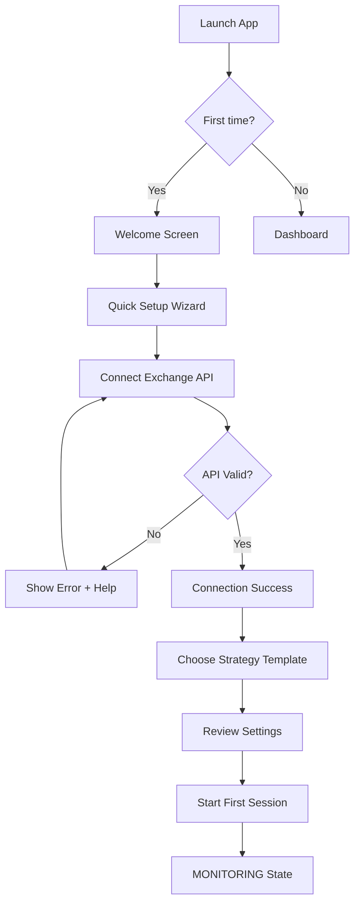
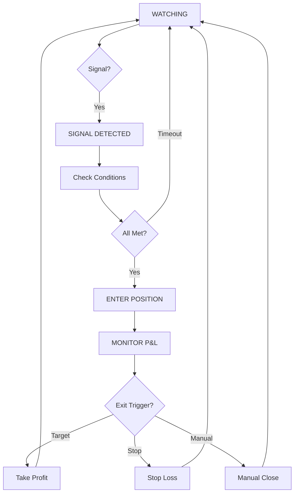

# UX Design Specification - FX Agent AI

**Author:** Mr Lu
**Date:** 2025-12-20

---

## Executive Summary

### Project Vision

FX Agent AI is a **Pump & Dump Detection Platform** - a trading automation tool that helps cryptocurrency traders detect market pumps, enter short positions at the peak, and exit with profit. The system uses a sophisticated **5-section state machine** (S1→O1→Z1→ZE1→E1) controlling the complete trading lifecycle.

**Core Philosophy:** "Build a TOOL, not a strategy" - traders configure and optimize their own parameters.

**Current State:** Brownfield project with most features built, but UI suffers from poor information architecture - too much complexity, unclear hierarchy, and suboptimal information density.

**Core UX Problem:** UI exists but is difficult, unreadable, unclear. Not missing features - missing clarity.

### Target Users

**Primary Persona: Intermediate Trader (Trader B)**
- Understands trading concepts, not a programmer
- Wants: Transparency, confidence, speed
- Key need: "Show me what matters NOW, hide what doesn't"
- Success: Glance → Understand → Act in under 5 seconds

**Secondary Persona: Beginner Trader (Trader A)**
- Learning pump/dump patterns
- Wants: Guidance, templates, explanations
- Key need: "Hold my hand until I get it"
- Success: Complete first profitable backtest with guidance

**Tertiary Persona: Advanced Trader (Trader C)**
- Power user, wants maximum control
- Wants: Data access, customization, API
- Key need: "Give me tools, get out of my way"
- Success: Custom setup that matches personal workflow

### User Needs Priority Matrix

| Need | Beginner | Intermediate | Advanced | Priority |
|------|----------|--------------|----------|----------|
| State-aware UI | Nice | **CRITICAL** | Nice | P1 |
| Glanceable status | Nice | **CRITICAL** | Expected | P1 |
| Human labels | **CRITICAL** | Important | Optional | P1 |
| Onboarding wizard | **CRITICAL** | Nice | Skip | P2 |
| Keyboard shortcuts | Don't care | Important | **CRITICAL** | P2 |
| Expert mode | Don't care | Nice | **CRITICAL** | P3 |

### Key Design Challenges

1. **Information Overload vs. Clarity** - Need optimal density, not maximum features
2. **5-Section System Complexity** - Powerful but confusing terminology
3. **State Machine Visibility** - Users must see WHAT and WHY
4. **No Onboarding Path** - Users don't know where to start
5. **Power User Retention** - Can't sacrifice depth for simplicity

### Design Opportunities

1. **"One Question Dashboard"** - Every element answers "What should I do now?"
2. **State-Driven Information Density** - Context determines content
3. **Journey Bar Navigation** - Visual progress through trading flow
4. **Hide-First Design** - Clean default, power on demand
5. **Human Vocabulary** - Replace S1/Z1/E1 with action words

---

## Design Philosophy

### Core Question

**"What should I do right now?"**

Every UI element must help answer this question. If it doesn't → remove it.

### Five States of User Attention

1. **WAIT** - Nothing happening, low attention (👀 Watching)
2. **ALERT** - Something detected, attention rising (🔥 Found!)
3. **DECIDE** - Action may be needed, full attention (🎯 Entering)
4. **MONITOR** - Position active, watching outcome (📈 Monitoring)
5. **REVIEW** - Session ended, learning mode (✅ Done)

### Vocabulary Transformation

| Technical | Human | Icon |
|-----------|-------|------|
| MONITORING | Watching | 👀 |
| S1 (Signal Detection) | Found! | 🔥 |
| O1 (Signal Cancellation) | False Alarm | ❌ |
| Z1 (Entry Conditions) | Entering | 🎯 |
| POSITION_ACTIVE | Monitoring | 📈 |
| ZE1 (Close Order) | Taking Profit | 💰 |
| E1 (Emergency Exit) | Stopping Loss | 🛑 |

---

## Design Principles

### 1. State-Driven Information Density

Each state machine state defines its own UI mode:

- **MONITORING Mode:** Calm, minimal (3-4 key metrics)
- **SIGNAL_DETECTED Mode:** Alert, focused (countdown, conditions)
- **POSITION_ACTIVE Mode:** Intense, P&L-centric

### 2. Progressive Disclosure with Consistent Anchors

- **Level 1 (Always visible):** State badge, primary metric
- **Level 2 (Context-dependent):** Relevant details for current state
- **Level 3 (On-demand):** Expandable panels for deep dive
- **Anchor points:** Same position regardless of mode

### 3. Glanceability First, Details Second

- **2-second rule:** Understand situation in 2 seconds
- **Visual hierarchy:** Size + Color + Position = Importance
- **White space as feature, not waste**

### 4. Expert Mode as First-Class Citizen

- Not an afterthought toggle
- Keyboard shortcuts from day one
- Technical labels available as preference option
- Customizable layouts for power users

### 5. Error Visibility > Aesthetics

- Never sacrifice error visibility for clean look
- Connection status always prominent when unhealthy
- Sound alerts for critical issues
- Error states impossible to miss

---

## Innovation Opportunities

### High-Impact Quick Wins

| Innovation | Description | Effort | Impact |
|------------|-------------|--------|--------|
| **Status Hero Component** | State + P&L combined in one prominent element | Medium | High |
| **Journey Bar Navigation** | Watching → Found → Enter → Monitor → Exit | Medium | High |
| **Condition Progress Bars** | Visual progress, not checkboxes | Low | Medium |
| **Human Vocabulary** | Replace S1/Z1/E1 throughout | Low | High |

### Medium-Term Innovations

| Innovation | Description | Effort | Impact |
|------------|-------------|--------|--------|
| **Now Trading Bar** | Spotify-style persistent footer when position active | Medium | High |
| **Gaming Adaptations** | P&L as health bar, celebration animations | Medium | Medium |
| **Sound Alerts** | Audio signals for state changes | Low | Medium |

### Paradigm Shifts

| Innovation | Description | Effort | Impact |
|------------|-------------|--------|--------|
| **Reverse Learning Flow** | Try first, configure later | High | High |
| **Hide-First Design** | Clean default, reveal power on demand | Medium | High |

---

## UX Risk Prevention

### Critical Design Rules

1. **Error states MUST be impossible to miss** - Full-screen if critical
2. **Every transition shows reason inline** - Not click-to-reveal
3. **Color-code exits:** 💚 Profit / 🔴 Stop Loss / 🟡 Manual
4. **Performance tested under load** - Simulate pump conditions
5. **Onboarding is the experience** - Can't be skipped

### Pre-launch Checklist

- [ ] Beta test with 3+ advanced traders
- [ ] Load test during simulated pump (1000+ ticks/sec)
- [ ] Disconnect test: user notices within 3 seconds
- [ ] New user test: completes first backtest without help
- [ ] Mobile test: can close position on phone
- [ ] Transition test: user explains why each transition happened

### Risk Prevention Matrix

| Risk | Prevention | Priority |
|------|------------|----------|
| Power users feel abandoned | Expert mode first-class, beta test with advanced traders | P1 |
| Errors hidden by clean design | Error states impossible to miss, sound alerts | P1 |
| Transition reasons unclear | Inline explanation, color-coded exits | P1 |
| Performance during high activity | Load test during simulated pumps, throttling | P1 |
| Onboarding skipped | Make it the experience, not optional | P2 |
| No mobile fallback | Emergency panel responsive | P2 |

---

## Core User Experience

### Defining Experience

**The Core Loop:**

```
👀 Watch → 🔥 Detect → 🎯 Enter → 📈 Monitor → 💰/🛑 Exit → 👀 Watch again
```

**Primary User Action:** Monitor state machine and react to trading opportunities.

**Critical Interaction:** The 60-second window from "Signal Detected" to "Entry Decision" - this is where user trust is built or broken. The system must:
- Show clear signal strength and confidence
- Display countdown to decision deadline
- Visualize which conditions are met/pending
- Explain WHY this signal was detected

**Core Question Every Screen Must Answer:** "What should I do right now?"

### Platform Strategy

| Aspect | Decision | Rationale |
|--------|----------|-----------|
| **Primary Platform** | Desktop Web (1920x1080+) | Complex trading interface, multi-panel layout |
| **Browsers** | Chrome, Firefox, Edge (latest) | Modern JS, WebSocket, no legacy support |
| **Primary Input** | Mouse + Keyboard | Quick actions, power user shortcuts |
| **Mobile Support** | Emergency-only responsive | Close position, view P&L - not full trading |
| **Offline Support** | Not required | Real-time trading requires live connection |
| **Multi-monitor** | Future consideration | Pop-out panels for advanced users |

**Platform Priorities:**
1. Desktop Chrome - primary development target
2. Desktop Firefox/Edge - tested, supported
3. Mobile emergency panel - responsive fallback
4. Tablet - not explicitly supported

### Effortless Interactions

**Zero-Friction Actions (must feel instant and natural):**

| Action | Implementation | Success Metric |
|--------|----------------|----------------|
| **Understand current state** | Status Hero component - state + P&L in one glance | < 2 seconds to comprehend |
| **See position P&L** | Largest element on screen when position active | Impossible to miss |
| **Know why transition happened** | Inline reason badge with every state change | No log-digging required |
| **Emergency close position** | Esc key or prominent red button | < 1 second to execute |
| **Start new session** | One-click with smart defaults | Single action to begin |
| **Navigate trading flow** | Journey Bar always visible | Always know where you are |

**Friction to Eliminate:**
- Reading technical jargon (S1/Z1/E1) - replaced with human words
- Hunting for P&L information - made prominent
- Understanding state machine state - visualized clearly
- Finding relevant indicators - context-aware display
- Confirming destructive actions - smart confirmation only when needed

### Critical Success Moments

**Moment 1: First Signal Detection**
- User sees 🔥 "Found!" badge for the first time
- Success feeling: "Wow, it actually works!"
- Design requirement: Make this moment celebratory, clear, exciting

**Moment 2: First Profitable Exit**
- Position closes with 💰 green P&L
- Success feeling: "I made money with this system!"
- Design requirement: Celebration animation, clear summary

**Moment 3: Understanding "Why"**
- User reads inline transition explanation
- Success feeling: "I understand what the system is doing"
- Design requirement: Every transition has visible, human-readable reason

**Moment 4: Trusting Automation**
- User lets system run without constant manual checking
- Success feeling: "I can rely on this"
- Design requirement: Consistent, predictable, transparent behavior

**Moment 5: Error Recovery**
- Connection drops and system handles gracefully
- Success feeling: "It recovered without losing my position"
- Design requirement: Visible status, auto-reconnect, clear recovery

### Experience Principles

1. **Answer "What Now?" Instantly**
   - Every screen state answers the user's primary question
   - No hunting for information, no interpretation needed

2. **State Drives Everything**
   - Current state machine state determines UI mode
   - Context-appropriate information density
   - Relevant actions for current situation

3. **Celebrate Success, Explain Failure**
   - Profitable exits get visual celebration
   - Losses get clear explanation of what happened
   - Every transition has visible reasoning

4. **Speed Over Polish**
   - Performance under load is non-negotiable
   - Quick actions (keyboard) before pretty animations
   - Response time < 100ms for user actions

5. **Trust Through Transparency**
   - Never hide what system is doing
   - Always show connection status
   - Log everything, make logs accessible

---

## Desired Emotional Response

### Emotional Context

Trading inherently triggers strong emotions that UX must actively manage:

| Trigger | Natural Emotion | UX Challenge |
|---------|-----------------|--------------|
| Money at stake | Anxiety, fear | Create calm confidence |
| Time pressure | Stress, rushing | Enable decisive action |
| Uncertainty | Doubt, paralysis | Provide clarity |
| Success | Euphoria, overconfidence | Celebrate but ground |
| Failure | Frustration, blame | Redirect to learning |

### Primary Emotional Goals

| Priority | Emotion | Description | Design Driver |
|----------|---------|-------------|---------------|
| P1 | **Confidence** | "I understand what's happening" | Transparency, human language |
| P1 | **Control** | "I can act when I need to" | Quick actions, visible options |
| P1 | **Clarity** | "I see what matters now" | State-driven density |
| P2 | **Calm Focus** | "I'm alert but not stressed" | Minimal UI, muted base colors |
| P2 | **Trust** | "The system does what it says" | Explained transitions |

### Emotional Journey Map

| Stage | Problem Emotion | Target Emotion | Design Response |
|-------|-----------------|----------------|-----------------|
| **First Visit** | Overwhelmed | Curious, guided | Onboarding wizard |
| **Learning** | Frustrated | Confident | Progressive disclosure |
| **Watching** | Bored | Calm, alert | Minimal UI, subtle pulse |
| **Signal Detected** | Anxious | Excited, prepared | Clear countdown, conditions |
| **Entering** | Nervous | Decisive | Confirmation feedback |
| **Monitoring** | Stressed | Calm, trusting | Prominent P&L, progress bar |
| **Profit Exit** | Relief | Pride, celebration | Animation, summary |
| **Loss Exit** | Angry | Understanding | Explanation, no blame |
| **Error** | Panic | Informed | Clear status, recovery path |

### Micro-Emotions

**Actively Create:**
- ✅ Confidence through visible system state
- ✅ Trust through explained decisions
- ✅ Accomplishment through progress tracking
- ✅ Delight through celebration moments

**Actively Prevent:**
- ❌ Confusion through jargon elimination
- ❌ Helplessness through always-visible actions
- ❌ Distrust through inline explanations
- ❌ Blame through neutral language on losses

### Design Implications

| Emotion | UX Implementation |
|---------|-------------------|
| **Confidence** | Human vocabulary, no S1/Z1/E1 jargon, "why" visible always |
| **Control** | Esc = emergency close, keyboard shortcuts, manual override |
| **Calm** | Muted colors during monitoring, white space, no blinking |
| **Excitement** | Animated 🔥 on signal, sound alert option, visual pop |
| **Trust** | Every transition badge explains reason, consistent patterns |
| **Pride** | Confetti on profit, session summary stats, streak counter |
| **Learning** | "What happened" breakdown on loss, indicator replay, no blame |

### Emotional Design Principles

1. **Manage Trading Anxiety**
   - Default state = calm, minimal, reassuring
   - Intensity increases only when action needed
   - Return to calm immediately after action

2. **Celebrate Wins, Explain Losses**
   - Profitable exits get visual celebration (confetti, sound)
   - Losses get clear, neutral explanation
   - Never use blame language ("failed", "error in your strategy")

3. **Build Trust Through Transparency**
   - Every system decision is visible and explained
   - No "magic" - user can trace any outcome
   - Connection status always visible

4. **Enable Decisive Action**
   - When action is needed, make it obvious
   - Reduce choices to essentials in critical moments
   - Confirm actions, but don't over-confirm

5. **Progress Creates Pride**
   - Track user achievements (first signal, first profit, streak)
   - Show improvement over time
   - Celebrate milestones

---

## UX Pattern Analysis & Inspiration

### Inspiration Sources

| Source | Pattern | Application to FX Agent AI |
|--------|---------|---------------------------|
| **Spotify** | Now Playing Bar | Persistent footer showing active position |
| **Video Games** | Health bars, celebrations | P&L visualization, profit animations |
| **TradingView** | Information density | Chart layouts, indicator organization |
| **Linear/Notion** | Keyboard-first design | Power user shortcuts |
| **Slack/Discord** | Status badges | Connection/system status |
| **Duolingo** | Streak counters | Trading session achievements |

### Genre Mashup Discoveries

| Mashup | Key Pattern | FX Agent AI Implementation |
|--------|-------------|---------------------------|
| **Trading + Racing Games** | Delta Display | "+$43 to target" format for P&L |
| **Trading + ICU Monitors** | Trend Arrows | ↑↓→ on all numeric indicators |
| **Trading + Video Editing** | Session Timeline | Visual trade history scrubber |
| **Trading + ATC** | Voice Callouts | Optional audio state announcements |
| **Trading + Kitchen** | Signal Tickets | Queue-style signal management |

### Comparative Analysis Matrix

**Evaluation Criteria (Weighted):**

| Criterion | Weight | Description |
|-----------|--------|-------------|
| Clarity | 25% | Answers "What should I do now?" |
| Speed | 20% | Comprehension in < 2 seconds |
| Emotional Impact | 15% | Creates confidence/trust |
| State Awareness | 20% | Adapts to trading state |
| Implementation Effort | 10% | Low/Medium/High complexity |
| Power User Fit | 10% | Works for advanced traders |

**Pattern Scoring Results:**

| Pattern | Source | Score | Tier |
|---------|--------|:-----:|:----:|
| Status Hero Component | Original | 9.1 | 🏆 T1 |
| Journey Bar Navigation | Original | 8.9 | 🏆 T1 |
| Delta Display | Racing | 8.8 | 🏆 T1 |
| Human Vocabulary | Original | 8.8 | 🏆 T1 |
| Now Playing Bar | Spotify | 8.5 | 🏆 T1 |
| Sound Alerts | ATC | 8.4 | 🥈 T2 |
| Condition Progress | Original | 8.3 | 🥈 T2 |
| Trend Arrows | ICU | 8.2 | 🥈 T2 |
| Health Bar P&L | Gaming | 7.9 | 🥈 T2 |
| Hide-First Design | Original | 7.9 | 🥈 T2 |
| Keyboard Shortcuts | Linear | 7.0 | 🥉 T3 |
| Signal Tickets | Kitchen | 6.9 | 🥉 T3 |
| Celebration Animation | Gaming | 6.5 | 🥉 T3 |
| Session Timeline | Video Ed | 6.4 | 🥉 T3 |

### Implementation Priority Order

```
PHASE 1: Core Clarity (Must Have)
├── 1. Human Vocabulary        → Terminology transformation
├── 2. Status Hero Component   → Dashboard centerpiece
└── 3. Journey Bar Navigation  → Header/footer navigation

PHASE 2: Position Experience (Should Have)
├── 4. Now Playing Bar         → Persistent position footer
├── 5. Delta Display           → "+$X to target" formatting
└── 6. Condition Progress      → Visual progress bars

PHASE 3: Polish & Power (Nice to Have)
├── 7. Sound Alerts            → Optional audio feedback
├── 8. Trend Arrows            → Indicator direction hints
├── 9. Hide-First Design       → Expert mode toggle
└── 10. Health Bar P&L         → Alternative P&L visualization
```

### Anti-Patterns to Avoid

| Anti-Pattern | Why Avoid | Alternative |
|--------------|-----------|-------------|
| Robinhood confetti on every action | Desensitizes users | Reserve for significant wins |
| Bloomberg Terminal density | Overwhelms intermediates | Progressive disclosure |
| Mobile-first trading | Wrong platform for complexity | Desktop-first, mobile emergency |
| Infinite scrolling logs | Buries critical info | Filtered, searchable, paginated |
| Hidden error states | Users miss critical issues | Impossible-to-miss alerts |

---

## Design System Foundation

### Design System Choice

**Selected System:** Material UI (MUI) v5+ with Trading-Specific Customization

**Decision Type:** Enhance existing system (brownfield optimization)

### Rationale for Selection

1. **Zero Migration Risk** - MUI already integrated in Next.js codebase
2. **Component Coverage** - DataGrid, Charts, Dialogs cover trading dashboard needs
3. **Theming Capability** - Can implement state-driven color schemes
4. **Dark Mode Native** - Essential for trader eye comfort during long sessions
5. **Accessibility Built-in** - WCAG 2.1 AA compliance out-of-box

### Implementation Approach

| Layer | Approach | Priority |
|-------|----------|----------|
| **Theme Layer** | Custom palette, typography, spacing | P1 |
| **State Variants** | Mode-specific component styling | P1 |
| **Custom Components** | StatusHero, JourneyBar, ConditionProgress | P1 |
| **Animations** | Celebration effects, state transitions | P2 |
| **Accessibility** | Keyboard nav, screen reader optimization | P2 |

### Customization Strategy

**Trading Color Palette:**

| State | Primary Color | Usage |
|-------|---------------|-------|
| MONITORING | Slate/Muted Blue | Calm, low-attention |
| SIGNAL_DETECTED | Amber/Orange | Alert, attention-rising |
| POSITION_ACTIVE | Deep Blue | Focused, monitoring |
| PROFIT | Green | Success, celebration |
| LOSS | Red | Warning, learning |

**Typography Scale:**

| Element | Size | Weight | Use Case |
|---------|------|--------|----------|
| Hero Metric | 48-64px | Bold | P&L display |
| State Badge | 24px | Semibold | Current state |
| Label | 14px | Medium | Field labels |
| Data | 16px | Regular | Values |
| Caption | 12px | Regular | Secondary info |

**Custom Components Required:**

| Component | Purpose | Priority |
|-----------|---------|----------|
| **StatusHero** | Combined state + P&L display (largest element) | P1 |
| **JourneyBar** | Visual trading flow navigation | P1 |
| **ConditionProgress** | Visual progress bars for conditions | P1 |
| **DeltaDisplay** | "+$X to target" formatted metrics | P2 |
| **TransitionBadge** | Inline "why" explanations | P2 |

---

## Defining Core Experience

### The Signature Interaction

**Defining Experience:** The 60-second Signal-to-Entry Decision Window

This is the moment that defines FX Agent AI - when the system detects a pump signal and the user watches conditions being evaluated in real-time, understanding exactly what the system sees and why it's making decisions.

**User Narrative:** "I see a pump starting, I watch the conditions check off one by one, I understand why we're entering, and I trust the system to execute."

### User Mental Model

**Expectations:**
- Transparency: "Show me what you see"
- Control: "Let me override if needed"
- Trust: "Explain why you did that"
- Clarity: "Don't make me think"

**Mental Model Mapping:**

| User Thought | System Response |
|--------------|-----------------|
| "What's happening?" | StatusHero with current state |
| "Why this signal?" | Inline "Why:" explanation |
| "How close to entry?" | Condition progress bars |
| "Can I stop it?" | Visible PAUSE/CANCEL buttons |
| "Did it work?" | P&L display + exit reason |

### Success Criteria

| Criterion | Target |
|-----------|--------|
| State comprehension | < 2 seconds |
| Signal explanation accessible | 100% visible |
| Manual override time | < 1 second |
| Trust achievement | After 5 trades |
| Error detection | < 3 seconds |

### Novel UX Patterns

| Pattern | Innovation | Education |
|---------|------------|-----------|
| State Machine Visibility | Shows internal logic | First-time tooltip |
| Inline Transition Reasons | No log-digging needed | "Why?" affordance |
| Journey Bar Navigation | Trading flow awareness | Self-explanatory |
| Condition Progress Bars | Familiar but new context | Intuitive |

### Experience Mechanics

**The Core Flow:**

```
DETECTION → EVALUATION → DECISION → EXECUTION → MONITORING
    🔥          ████         ⏱️          🎯          📈
```

| Phase | User Action | System Response | Feedback |
|-------|-------------|-----------------|----------|
| Detection | None (auto) | Signal detected | 🔥 badge + sound + UI shift |
| Evaluation | Watch | Progress updates | Bars fill, conditions check |
| Decision | Override or wait | Enter or cancel | Countdown + action buttons |
| Execution | (Auto or manual) | Position opened | State → POSITION_ACTIVE |
| Monitoring | Watch P&L | Track progress | P&L hero + journey update |

### Signal Detection UI Wireframe

```
┌─────────────────────────────────────────────────────────────┐
│  🔥 FOUND! Signal Detected on BTCUSDT                       │
│  ─────────────────────────────────────────────────────────  │
│  Why: Volume spike 340% + RSI divergence + Pattern match    │
├─────────────────────────────────────────────────────────────┤
│  CONDITIONS FOR ENTRY:                    ⏱️ 47s remaining  │
│  ████████████░░░░░░░░░ 60%                                  │
│                                                             │
│  ✅ Volume spike > 300%           340%                      │
│  ✅ RSI divergence                Confirmed                 │
│  ⏳ Price confirmation            Waiting... ($45,230)      │
│  ○  Momentum check                Pending                   │
│                                                             │
│  ┌─────────────────┐  ┌─────────────────┐                   │
│  │  ⏸️ PAUSE       │  │  ❌ CANCEL      │                   │
│  └─────────────────┘  └─────────────────┘                   │
└─────────────────────────────────────────────────────────────┘
```

---

## Visual Design Foundation

### Color System

**Philosophy:** State-driven colors that communicate meaning, not just aesthetics.

**State Colors:**

| State | Color | Hex | Usage |
|-------|-------|-----|-------|
| Monitoring | Slate | `#64748B` | Calm, watching |
| Signal Detected | Amber | `#F59E0B` | Alert, attention |
| Position Active | Blue | `#3B82F6` | Focused monitoring |
| Profit | Green | `#10B981` | Success, gains |
| Loss | Red | `#EF4444` | Warning, losses |
| Neutral | Gray | `#6B7280` | Inactive, disabled |

**Semantic Tokens:**

| Token | Light Mode | Dark Mode | Purpose |
|-------|------------|-----------|---------|
| `--bg-primary` | `#FFFFFF` | `#0F172A` | Main background |
| `--bg-secondary` | `#F8FAFC` | `#1E293B` | Cards, panels |
| `--text-primary` | `#0F172A` | `#F8FAFC` | Main text |
| `--text-secondary` | `#64748B` | `#94A3B8` | Labels, hints |
| `--border-default` | `#E2E8F0` | `#334155` | Dividers |

**Theme Support:** Light and Dark modes with automatic switching preference.

### Typography System

**Font Stack:**

| Role | Font | Fallback | Usage |
|------|------|----------|-------|
| Primary | Inter | system-ui, sans-serif | UI text |
| Monospace | JetBrains Mono | monospace | Numbers, prices |

**Type Scale:**

| Token | Size | Weight | Usage |
|-------|------|--------|-------|
| Hero | 48px | 700 | P&L display |
| H1 | 32px | 600 | Section headers |
| H2 | 24px | 600 | Panel titles |
| H3 | 20px | 500 | Card headers |
| Body | 16px | 400 | Default text |
| Label | 14px | 500 | Field labels |
| Caption | 12px | 400 | Secondary info |

**Numeric Display:** All prices and percentages use JetBrains Mono for alignment and clarity.

### Spacing & Layout

**Base Unit:** 4px

**Spacing Scale:** 4px → 8px → 12px → 16px → 24px → 32px → 48px

**Layout Structure:**

```
┌────────────────────────────────────────────────────────────┐
│  HEADER: Journey Bar + Status Hero (Fixed, 64px)           │
├──────────────────────┬─────────────────────────────────────┤
│  SIDEBAR (280px)     │  MAIN CONTENT (Fluid)               │
│  Navigation          │  State-driven panels                │
├──────────────────────┴─────────────────────────────────────┤
│  FOOTER: Now Playing Bar (56px, when position active)      │
└────────────────────────────────────────────────────────────┘
```

**Breakpoints:**

| Name | Width | Behavior |
|------|-------|----------|
| Desktop XL | ≥1920px | Full layout |
| Desktop | ≥1440px | Standard |
| Desktop SM | ≥1280px | Compact sidebar |
| Emergency | <1280px | Mobile emergency only |

### Accessibility

| Requirement | Standard | Implementation |
|-------------|----------|----------------|
| Color Contrast | WCAG 2.1 AA | ≥4.5:1 for text |
| Focus Indicators | WCAG 2.1 AA | 2px solid ring |
| Keyboard Navigation | WCAG 2.1 AA | Full tab order |
| Screen Readers | WCAG 2.1 AA | ARIA labels |
| Reduced Motion | WCAG 2.1 AAA | Respects preference |
| Color Independence | WCAG 2.1 AA | Icons supplement color |

**Color-Blind Support:**

| State | Color | Icon Backup |
|-------|-------|-------------|
| Profit | Green | ↑ arrow |
| Loss | Red | ↓ arrow |
| Signal | Amber | 🔥 icon |

---

## Design Direction Decision

### Design Directions Explored

Four primary layout approaches were evaluated:

| Direction | Description | Best For |
|-----------|-------------|----------|
| **Command Center** | Hero-centric, full-width, horizontal | Power users, multi-tasking |
| **Split Focus** | Left sidebar hero, wide content area | Intermediate users, clarity |
| **Dashboard Grid** | Modular card grid, equal weight | Customization, flexibility |
| **Minimal Focus** | Centered, maximum focus, minimal chrome | Critical moments, beginners |

### Chosen Direction

**Hybrid State-Driven Layout**

The UI adapts its layout based on the current trading state:

| State | Layout | Rationale |
|-------|--------|-----------|
| MONITORING | Minimal Focus | Low cognitive load when waiting |
| SIGNAL_DETECTED | Command Center | Maximum information when deciding |
| POSITION_ACTIVE | Split Focus | P&L hero with context |

### Design Rationale

1. **Matches attention needs** - More info when needed, less when not
2. **Reduces cognitive load** - Calm UI during calm moments
3. **Maintains consistency** - Same components, different arrangement
4. **Supports all personas** - Beginners see simple, experts get density

### Layout Wireframes

**MONITORING State (Minimal Focus):**
```
┌─────────────────────────────────────────────────────────────────┐
│                         👀 WATCHING                             │
│                        24 pairs active                          │
│                                                                 │
│                   No signals detected yet                       │
│                                                                 │
│ ○──○──○──○──○                                      Session: $0  │
└─────────────────────────────────────────────────────────────────┘
```

**SIGNAL_DETECTED State (Command Center):**
```
┌─────────────────────────────────────────────────────────────────┐
│ 🔥 FOUND! BTCUSDT          [○──●──○──○──○]              ⚙️ 👤  │
├─────────────────────────────────────────────────────────────────┤
│   ┌─────────────────────────────────────────────────────────┐   │
│   │     🔥 Signal Detected  •  +$0.00  •  ⏱️ 47s remaining  │   │
│   └─────────────────────────────────────────────────────────┘   │
│   ┌──────────────────────┐  ┌──────────────────────┐           │
│   │   CONDITIONS ████░░  │  │   INDICATORS          │           │
│   │   ✅ Volume  ⏳ Price │  │   RSI: 72 ↑  Vol: 340%│           │
│   └──────────────────────┘  └──────────────────────┘           │
│        [⏸️ PAUSE]                    [❌ CANCEL]                │
└─────────────────────────────────────────────────────────────────┘
```

**POSITION_ACTIVE State (Split Focus):**
```
┌─────────────────────────────────────────────────────────────────┐
│ FX Agent AI    [○──○──●──○──○]                          ⚙️ 👤  │
├────────────────────┬────────────────────────────────────────────┤
│  📈 MONITORING     │   POSITION DETAILS                         │
│  ┌──────────────┐  │   Entry: $45,230  •  Current: $45,180     │
│  │   +$127.50   │  │   Target: $44,800  •  Stop: $45,400       │
│  │    +0.28%    │  │                                            │
│  │              │  │   Time in position: 2m 34s                 │
│  │  🎯 Target:  │  │   Progress to target: ████████░░ 78%      │
│  │  +$43 away   │  │                                            │
│  └──────────────┘  │   [🛑 EMERGENCY CLOSE]                     │
├────────────────────┴────────────────────────────────────────────┤
│ 📈 BTCUSDT Short  •  +$127.50 (+0.28%)  •  Target: +$43 away   │
└─────────────────────────────────────────────────────────────────┘
```

### Implementation Approach

| Phase | Task | Components |
|-------|------|------------|
| 1 | Build component library | StatusHero, JourneyBar, ConditionProgress |
| 2 | Create layout variants | Minimal, CommandCenter, SplitFocus |
| 3 | Implement state transitions | Smooth animations between layouts |
| 4 | User testing | Validate across all three states |

---

## User Journey Flows

### Journey 1: First Session Setup



**Target:** < 5 minutes from launch to first session

### Journey 2: The Trading Loop



**Core Loop:** Watch → Detect → Enter → Monitor → Exit → Watch

### Journey 3: Signal Response (60-Second Window)

| Phase | Duration | User Action | System Response |
|-------|----------|-------------|-----------------|
| Alert | 0s | None | Sound + UI shift |
| Observe | 0-60s | Watch/Override | Progress bars fill |
| Decide | Auto | Pause/Cancel/Wait | Countdown visible |
| Execute | 60s or conditions met | None | Auto-entry |

**Critical Elements:**
- "Why:" explanation always visible
- Pause/Cancel buttons accessible
- Progress bar shows condition status
- Countdown impossible to miss

### Journey 4: Position Exit

| Exit Type | Color | Animation | Follow-up |
|-----------|-------|-----------|-----------|
| Target Hit | 💚 Green | Celebration | Profit summary |
| Stop Loss | 🔴 Red | Calm transition | Loss explanation |
| Manual Close | 🟡 Yellow | Neutral | Session stats |
| Emergency | 🟡 Yellow | Immediate | Confirmation |

**Design Rule:** Losses get explanation, never blame.

### Journey 5: Error Recovery

| Scenario | Detection | Response | Recovery |
|----------|-----------|----------|----------|
| Brief disconnect (<3s) | Auto | Silent reconnect | Resume |
| Medium disconnect (3-10s) | Banner | Auto-reconnect | Toast confirmation |
| Extended disconnect (>10s) | Full warning | Manual options | Emergency close available |
| Position at risk | Impossible to miss | Critical alert | Backup close channel |

### Journey Patterns

| Pattern | Description | Usage |
|---------|-------------|-------|
| **State Transition** | Inline reason + animation | All state changes |
| **Progressive Disclosure** | Level 1 → 2 → 3 | Complex information |
| **Confirmation Gateway** | Single confirm dialog | Destructive actions only |
| **Auto-Recovery** | Silent if fast, toast if slow | Connection issues |
| **Celebration Moment** | Confetti + stats | Profitable exits |
| **Learning Moment** | Explanation, no blame | Losses |

### Flow Optimization Principles

1. **One click to start** - Session begins with single action
2. **Auto-progress when safe** - Conditions check without user
3. **Override always available** - Pause, Cancel, Close accessible
4. **Failures teach** - Every loss explains what happened
5. **Recovery is automatic** - Reconnect without user intervention

---

## Component Strategy

### Design System Components (MUI v5)

| Category | Components Used |
|----------|----------------|
| Layout | Box, Container, Grid, Stack |
| Inputs | TextField, Select, Switch, Slider |
| Display | Typography, Badge, Chip, Tooltip |
| Feedback | Alert, Snackbar, Dialog, Progress |
| Navigation | Tabs, Drawer, Menu |
| Data | DataGrid, Table (MUI X) |

### Custom Components

#### StatusHero

**Purpose:** Central dashboard element combining state + P&L.

| Property | Type | Description |
|----------|------|-------------|
| `state` | enum | MONITORING, SIGNAL_DETECTED, POSITION_ACTIVE |
| `pnl` | number | Current P&L value |
| `symbol` | string | Trading pair |
| `countdown` | number | Seconds remaining |

**States:** Slate (watching), Amber (signal), Blue (position)

#### JourneyBar

**Purpose:** Visual trading flow progress indicator.

```
○──●──○──○──○
👀   🔥   🎯   📈   💰
```

| Property | Type | Description |
|----------|------|-------------|
| `currentStep` | number | 0-4 position |
| `steps` | array | Labels and icons |

**Variants:** Compact (icons), Full (icons + labels), Mini (dots)

#### ConditionProgress

**Purpose:** Multi-condition tracker with visual progress.

| Property | Type | Description |
|----------|------|-------------|
| `conditions` | array | Condition objects |
| `overallProgress` | number | 0-100 percentage |
| `countdown` | number | Seconds remaining |

**Condition States:** ○ Pending, ⏳ Checking, ✅ Met, ❌ Failed

#### DeltaDisplay

**Purpose:** Formatted change metrics with trend arrows.

| Property | Type | Description |
|----------|------|-------------|
| `value` | number | Current value |
| `target` | number | Target (optional) |
| `format` | enum | absolute, percentage, toTarget |

**Variants:** Hero (48px), Standard (24px), Compact (16px)

#### TransitionBadge

**Purpose:** Inline explanation of state transitions.

| Property | Type | Description |
|----------|------|-------------|
| `type` | enum | SIGNAL, PROFIT, LOSS, CANCEL, MANUAL |
| `reason` | string | Human-readable explanation |
| `expandable` | boolean | Show details on click |

#### NowPlayingBar

**Purpose:** Persistent footer showing active position.

| Property | Type | Description |
|----------|------|-------------|
| `position` | object | Active position details |
| `visible` | boolean | Only when position active |
| `onClose` | function | Emergency close callback |

### Component Implementation Strategy

| Category | Strategy |
|----------|----------|
| Foundation | Use MUI directly |
| Layout | Extend MUI with custom tokens |
| Data Display | MUI X + custom styling |
| Trading-Specific | Build custom with MUI styled() |

### Implementation Roadmap

| Phase | Components | Priority |
|-------|------------|----------|
| **Phase 1** | StatusHero, JourneyBar, ConditionProgress | Must ship |
| **Phase 2** | DeltaDisplay, TransitionBadge, NowPlayingBar | Position experience |
| **Phase 3** | Sound alerts, Celebrations, Expert variants | Enhancement |

---

## UX Consistency Patterns

### Button Hierarchy

| Level | Style | Usage | Example |
|-------|-------|-------|---------|
| **Primary** | Filled, prominent | Main action per screen | Start Session, Enter Position |
| **Secondary** | Outlined | Supporting actions | Pause, Cancel, Settings |
| **Tertiary** | Text only | Minor actions | View Details, Reset, Skip |
| **Destructive** | Red, requires confirm | Irreversible actions | Close Position, Delete |

**Rules:**
- Only ONE primary action per screen
- Destructive actions require confirmation modal
- Keyboard shortcuts shown in tooltips

### State Transition Patterns

Every state transition displays:
1. **Icon** - Visual state indicator
2. **Human Label** - Not technical jargon
3. **Why** - Reason for transition
4. **Timestamp** - When it occurred

| Transition | Icon | Color | Animation |
|------------|------|-------|-----------|
| → SIGNAL_DETECTED | 🔥 | Amber | Pulse glow |
| → POSITION_ACTIVE | 🎯 | Blue | Slide in |
| → TAKE_PROFIT | 💰 | Green | Confetti |
| → STOP_LOSS | 🛑 | Red | Calm fade |
| → MONITORING | 👀 | Slate | Fade out |

### Feedback Patterns

| Type | Icon | Color | Duration | Sound |
|------|------|-------|----------|-------|
| Success | ✅ | Green | Auto 3s | Optional chime |
| Error | ❌ | Red | Persist | Alert tone |
| Warning | ⚠️ | Amber | While true | None |
| Info | ℹ️ | Blue | Auto 5s | None |

**Error Pattern:** Always show recovery action button.

### Loading States

| State | Visual | Behavior |
|-------|--------|----------|
| Data loading | Skeleton | Show what's loading |
| Connection | 🟢🟡🔴 | Always visible |
| Action pending | Spinner | Disable button |

### Modal Patterns

**Confirmation (Destructive):**
- Clear title stating action
- Consequence explanation
- Cancel left, Action right
- Destructive button in red

**Settings:**
- Title + close button
- Scrollable form content
- Footer: Reset, Cancel, Save

### Empty States

| State | Content |
|-------|---------|
| No signals | Friendly icon + "Watching for..." + scan status |
| No history | Icon + "No trades yet" + next step hint |
| No data | Icon + explanation + action if available |

### Navigation Patterns

**Keyboard Shortcuts:**

| Action | Key |
|--------|-----|
| Emergency Close | `Esc` |
| Pause/Resume | `Space` |
| Dashboard | `D` |
| History | `H` |
| Settings | `S` |
| Logs | `L` |
| Toggle Sidebar | `[` |

---

## Responsive Design & Accessibility

### Responsive Strategy

**Platform Priority:**

| Platform | Priority | Use Case |
|----------|----------|----------|
| Desktop XL (≥1920px) | Primary | Full trading experience |
| Desktop (≥1440px) | Secondary | Standard layout |
| Desktop SM (≥1280px) | Tertiary | Compact sidebar |
| Mobile (<1280px) | Emergency | Close position only |

**Approach:** Desktop-first. Mobile serves only as emergency fallback for position management.

### Breakpoint Strategy

| Breakpoint | Layout | Features |
|------------|--------|----------|
| ≥1920px | Full multi-panel | All features, expanded |
| ≥1440px | Standard | Full features |
| ≥1280px | Compact | Collapsible sidebar |
| <1280px | Emergency | Status + close only |

### Accessibility Strategy

**Target:** WCAG 2.1 Level AA

| Requirement | Implementation |
|-------------|----------------|
| Color Contrast | 4.5:1 text, 3:1 large text |
| Focus Indicators | 2px solid ring on all interactive |
| Keyboard Navigation | Full tab order + shortcuts |
| Screen Readers | ARIA labels on all controls |
| Touch Targets | 44x44px minimum |
| Reduced Motion | Respect `prefers-reduced-motion` |

**Color-Blind Support:**

| State | Color | Icon Backup |
|-------|-------|-------------|
| Profit | Green | ↑ arrow |
| Loss | Red | ↓ arrow |
| Signal | Amber | 🔥 + pulse |

### Testing Strategy

| Category | Approach | Frequency |
|----------|----------|-----------|
| Responsive | Chrome DevTools + real devices | Every feature |
| Accessibility | axe-core automated + manual | Every PR |
| Screen Reader | NVDA, VoiceOver | Weekly |
| Keyboard | Manual navigation test | Every feature |
| Performance | 1000+ ticks/sec load test | Pre-release |

### Implementation Guidelines

**Responsive:**
- Use relative units (rem, %, vw)
- Desktop-first media queries
- Test all breakpoints

**Accessibility:**
- Semantic HTML structure
- ARIA labels on icons
- `aria-live` for state changes
- Focus trapping in modals
- Skip links for navigation

---
