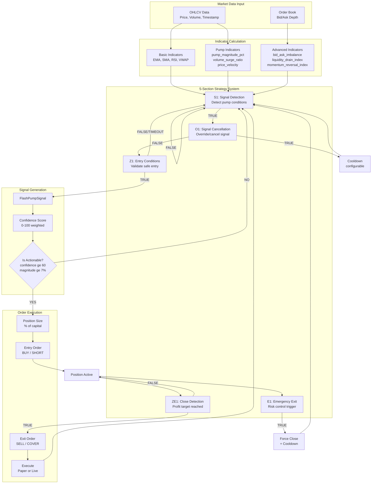
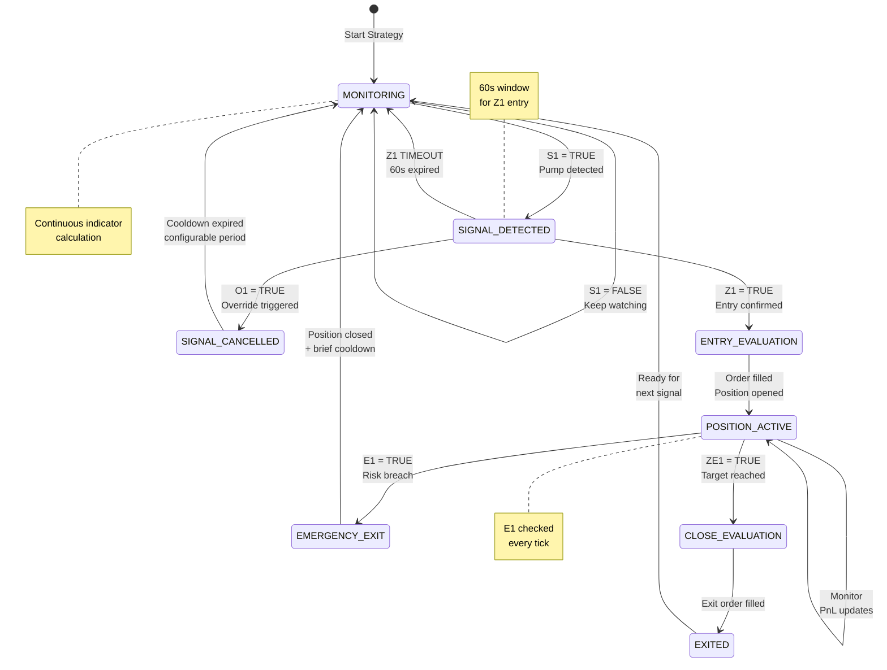
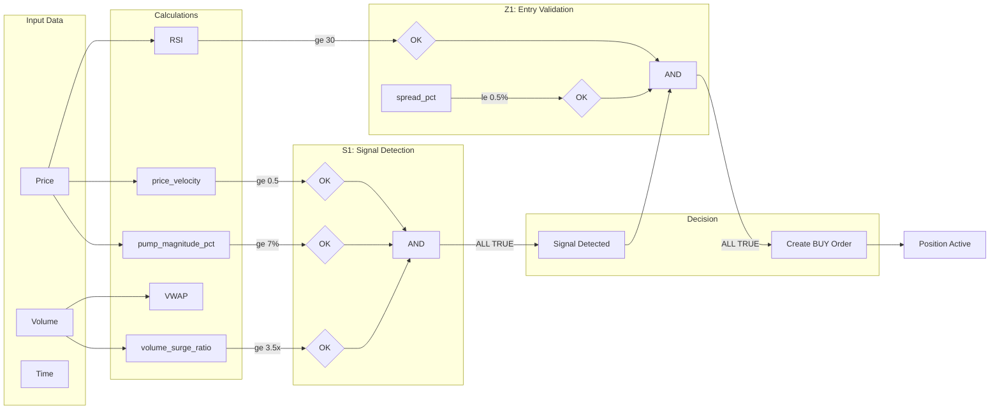

# Strategy, Indicators & Signal Flow

This document describes the complete data flow from market data through indicators, strategy evaluation, signal generation, to trading decisions.

---

## Overview

FX Agent AI uses a **5-section condition system** where each section controls a specific phase of the trading lifecycle:

| Section | Name | Purpose |
|---------|------|---------|
| **S1** | Signal Detection | Detect pump/market conditions |
| **O1** | Signal Cancellation | Override/cancel detected signal |
| **Z1** | Entry Conditions | Validate safe position entry |
| **ZE1** | Close Detection | Trigger profit-taking exit |
| **E1** | Emergency Exit | Risk control / forced exit |

---

## Main Flow Diagram



---

## Trading State Machine



---

## Indicator to Decision Flow



---

## Indicators Reference

### Basic Indicators

| Indicator | Description | Calculation |
|-----------|-------------|-------------|
| **EMA** | Exponential Moving Average | O(1) incremental smoothing |
| **SMA** | Simple Moving Average | O(1) with ring buffer |
| **RSI** | Relative Strength Index | Wilder's smoothing method |
| **VWAP** | Volume-Weighted Average Price | Cumulative price*volume / volume |

### Pump Detection Indicators

| Indicator | Description | Typical Threshold |
|-----------|-------------|-------------------|
| **pump_magnitude_pct** | % price increase from baseline | >= 7% |
| **volume_surge_ratio** | Volume multiplier vs baseline | >= 3.5x |
| **price_velocity** | Rate of price change per second | >= 0.5 |
| **bid_ask_imbalance** | Order book pressure | Variable |
| **liquidity_drain_index** | Liquidity analysis | Variable |
| **momentum_reversal_index** | Reversal detection | Variable |

### Position Indicators

| Indicator | Description | Usage |
|-----------|-------------|-------|
| **unrealized_pnl_pct** | Current P&L percentage | ZE1/E1 conditions |
| **spread_pct** | Bid-ask spread | Z1 entry validation |
| **twpa** | Time-weighted price average | Signal confirmation |

---

## 5-Section Condition System

### S1: Signal Detection

**Purpose:** Detect market conditions matching pump signals

**Example conditions:**
```yaml
conditions:
  - indicator: pump_magnitude_pct
    operator: ">="
    value: 7.0
  - indicator: volume_surge_ratio
    operator: ">="
    value: 3.5
  - indicator: price_velocity
    operator: ">="
    value: 0.5
require_all: true
```

**Trigger:** MONITORING state checks S1 continuously

**Output:** TRUE = transition to SIGNAL_DETECTED

---

### O1: Signal Cancellation

**Purpose:** Cancel/override detected signal if conditions change

**Example conditions:**
```yaml
conditions:
  - indicator: pump_magnitude_pct
    operator: "<"
    value: 3.0
require_all: true
cooldown_minutes: 30
```

**Trigger:** SIGNAL_DETECTED state checks O1

**Output:** TRUE = transition to SIGNAL_CANCELLED + cooldown

---

### Z1: Entry Conditions

**Purpose:** Validate safe entry into position

**Example conditions:**
```yaml
conditions:
  - indicator: rsi
    operator: ">="
    value: 30
  - indicator: spread_pct
    operator: "<="
    value: 0.5
require_all: true
timeout_seconds: 60

order_config:
  position_size_pct: 10
  stop_loss_pct: 5.0
  take_profit_pct: 25.0
```

**Trigger:** SIGNAL_DETECTED when S1=TRUE

**Output:** TRUE = create entry order, transition to POSITION_ACTIVE

---

### ZE1: Close Order Detection

**Purpose:** Generate exit orders based on profit targets

**Example conditions:**
```yaml
conditions:
  - indicator: unrealized_pnl_pct
    operator: ">="
    value: 20.0
require_all: true
```

**Trigger:** POSITION_ACTIVE state periodically checks ZE1

**Output:** TRUE = create exit order

---

### E1: Emergency Exit

**Purpose:** Immediate exit on emergency conditions

**Example conditions:**
```yaml
conditions:
  - indicator: unrealized_pnl_pct
    operator: "<="
    value: -5.0
  - indicator: volume_surge_ratio
    operator: "<="
    value: 0.5
require_all: false  # ANY condition triggers exit
cooldown_minutes: 5

actions:
  cancel_pending: true
  close_position: true
  log_event: true
```

**Trigger:** POSITION_ACTIVE state, checked continuously

**Output:** TRUE = force close position immediately

---

## Signal Generation

### FlashPumpSignal Structure

```python
FlashPumpSignal:
    symbol: str              # "BTC_USDT"
    exchange: str            # "MEXC"
    detection_time: datetime

    # Price metrics
    peak_price: float
    baseline_price: float
    pump_magnitude: float    # percentage

    # Volume metrics
    volume_surge_ratio: float
    price_velocity: float

    # Confidence
    confidence_score: float  # 0-100

    # Actionability
    is_actionable: bool      # confidence >= 60, magnitude >= 7%, age <= 60s
```

### Confidence Score Calculation

```
confidence = weighted_average(
    magnitude_score * 0.30,   # (magnitude / 20) * 100
    volume_score * 0.30,      # ((surge_ratio - 1) / 4) * 100
    velocity_score * 0.25,    # abs(velocity) * 100
    market_score * 0.15       # 70 - adjustments
)
```

---

## Key Components

| Component | Location | Purpose |
|-----------|----------|---------|
| **Indicators** | `src/domain/services/indicators/` | Calculate technical metrics |
| **Pump Detector** | `src/domain/services/pump_detector.py` | Detect pump patterns |
| **Strategy Manager** | `src/domain/services/strategy_manager.py` | 5-section condition system |
| **Order Manager** | `src/domain/services/order_manager.py` | Track orders and positions |
| **Trading Orchestrator** | `src/application/orchestrators/trading_orchestrator.py` | Wire components together |
| **EventBus** | `src/core/event_bus.py` | Async pub/sub messaging |
| **Strategy Builder UI** | `frontend/src/components/strategy/StrategyBuilder5Section.tsx` | Visual strategy editor |

---

## Decision Recording

System records indicator values at each decision point for audit trail:

| Decision Point | Recorded Indicators |
|----------------|---------------------|
| S1 Signal Detection | pump_magnitude_pct, volume_surge_ratio, price_momentum |
| O1 Signal Cancellation | pump_magnitude_pct |
| Z1 Entry Conditions | rsi, spread_pct, price_momentum |
| ZE1 Close Detection | unrealized_pnl_pct, price_momentum, pump_magnitude_pct |
| E1 Emergency Exit | pump_magnitude_pct, volume_surge_ratio |
