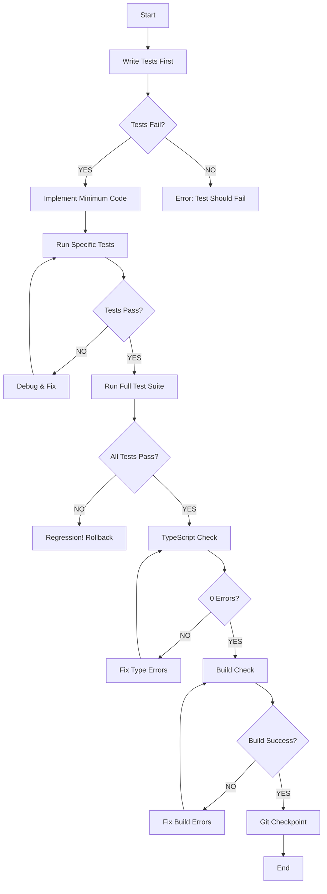

# Autonomous Delivery Process

**Purpose**: Systematyczny proces zapewniający autonomiczne dostarczenie działającego produktu bez regresji.

**Created**: 2025-11-19
**Status**: Active Process

---

## 🎯 Core Principles

### 1. **Small Steps with Verification**
Every change must be verified before moving forward:
- ✅ TypeScript compiles (0 errors)
- ✅ All tests pass
- ✅ Build succeeds
- ✅ No new warnings

**Rule**: NEVER proceed to next step if current step fails verification.

### 2. **Test-Driven Development (TDD)**
```
RED → GREEN → REFACTOR → VERIFY
```

1. **RED**: Write test (may fail initially)
2. **GREEN**: Implement minimum code to pass test
3. **REFACTOR**: Improve code while keeping tests green
4. **VERIFY**: Run ALL tests to ensure no regression

### 3. **Checkpoint System**
After successful verification:
- ✅ Git commit with clear message
- ✅ Document what works
- ✅ If problem occurs: instant rollback

### 4. **Production Readiness Checklist**
Before marking any task as "done":
- [ ] TypeScript: 0 errors
- [ ] Tests: All passing (e.g., 36/36)
- [ ] Build: Succeeds without errors
- [ ] No console warnings
- [ ] Manual verification (if UI change)
- [ ] Documentation updated

---

## 📋 Standard Workflow

### For Each Feature/Change:



### Detailed Steps:

#### **Step 1: Write Tests First** (if new functionality)
```bash
# Create test file or add test case
npm test -- <test-file> --watch
```

**Verify**: Test infrastructure works, test fails as expected (RED)

#### **Step 2: Implement Minimum Code**
```bash
# Edit source files
# Make smallest possible change to pass test
```

**Verify**: Code compiles
```bash
npx tsc --noEmit
# Must output: 0 errors
```

#### **Step 3: Run Specific Tests**
```bash
npm test -- <specific-test-file>
```

**Verify**: New tests pass (GREEN)

#### **Step 4: Run Full Test Suite**
```bash
npm test -- <main-test-file>.test.tsx
```

**Verify**: ALL tests pass (e.g., 36/36)
**Critical**: Check for regression in existing tests

#### **Step 5: TypeScript Check**
```bash
npx tsc --noEmit
```

**Verify**: 0 errors
**If errors**: Fix immediately or rollback

#### **Step 6: Build Check**
```bash
npm run build
```

**Verify**: Build succeeds without errors
**Check**: No new warnings in output

#### **Step 7: Git Checkpoint**
```bash
git add .
git commit -m "feat: <description> - verified <X>/<X> tests passing"
```

**ONLY commit if ALL above verifications passed**

---

## 🔧 Rollback Strategy

### When to Rollback:

```
IF (any verification fails) AND (cannot fix in < 5 minutes):
  1. STOP immediately
  2. Analyze root cause
  3. Document the issue
  4. Execute rollback
```

### Rollback Commands:

```bash
# Discard all uncommitted changes
git reset --hard HEAD

# Verify rollback successful
npm test -- <test-file>  # Should pass
npx tsc --noEmit          # Should have 0 errors
npm run build             # Should succeed
```

### Post-Rollback:

1. Document why rollback was necessary
2. Create isolated branch to fix issue
3. Test fix in isolation
4. Merge only when fully verified

---

## 📊 Verification Checklist Template

Use this for every feature/change:

```markdown
## Feature: [Feature Name]

### Pre-Implementation
- [ ] Requirements clear
- [ ] Tests written (if new functionality)
- [ ] Tests fail as expected (RED)

### Implementation
- [ ] Minimum code implemented
- [ ] TypeScript compiles (0 errors)
- [ ] Specific tests pass (GREEN)

### Verification
- [ ] Full test suite passes (X/X)
- [ ] No test regression
- [ ] TypeScript: 0 errors
- [ ] Build succeeds
- [ ] No new warnings

### Checkpoint
- [ ] Git commit created
- [ ] Documentation updated
- [ ] Ready for next feature
```

---

## 🚨 Common Pitfalls & Solutions

### Pitfall 1: "I'll test it later"
**Problem**: Changes accumulate, harder to debug when tests fail

**Solution**: Test IMMEDIATELY after each change

### Pitfall 2: "Just one more quick fix"
**Problem**: Quick fixes introduce regressions

**Solution**: Follow full verification cycle even for "quick fixes"

### Pitfall 3: "Tests are slow, I'll skip them"
**Problem**: Shipping broken code

**Solution**: Run tests in parallel, use `--watch` mode during development

### Pitfall 4: "It compiles, it must work"
**Problem**: TypeScript doesn't catch runtime errors

**Solution**: Always run full test suite before commit

### Pitfall 5: "I changed too much, don't know what broke"
**Problem**: Cannot isolate failure

**Solution**: Rollback and re-implement in smaller steps

---

## 📈 Success Metrics

### Sprint Success Criteria:

1. **Zero Regression**: All existing tests continue to pass
2. **New Tests Pass**: All new functionality tested
3. **Clean Build**: 0 TypeScript errors, 0 build errors
4. **Documentation**: All changes documented
5. **Git History**: Clear, atomic commits

### Example Success:

```
✅ Tests: 36/36 passing → 42/42 passing (+6 new tests)
✅ TypeScript: 0 errors
✅ Build: Success
✅ Git: 8 atomic commits with clear messages
✅ Docs: Updated with new features
```

---

## 🔄 Process Improvement

After each sprint, review:

1. **What worked well?**
   - Which steps prevented bugs?
   - Which verifications caught issues early?

2. **What needs improvement?**
   - Which steps were skipped? (Don't skip them!)
   - Which failures could have been prevented?

3. **Update process**
   - Add new verification steps if needed
   - Remove steps that don't add value

---

## 🎯 Sprint 17 Application

### Current Feature: Retry Mechanism

**Checkpoint 1**: fetchWithRetry utility
- ✅ Tests written first (21 tests)
- ✅ Implementation complete
- ✅ All tests pass (21/21)
- ✅ TypeScript: 0 errors
- ✅ Git commit: "feat: add fetchWithRetry utility with exponential backoff"

**Checkpoint 2**: Integrate into SessionConfigDialog
- ✅ Tests exist (36 existing tests)
- ✅ Implementation: Replace fetch() with fetchWithRetry()
- ⏳ VERIFYING: Full test suite (36/36)
- ⏳ VERIFYING: TypeScript check
- ⏳ VERIFYING: Build
- ⏳ PENDING: Git commit

**Next Checkpoint 3**: Error recovery UI
- ⏳ Write tests for Retry buttons
- ⏳ Implement Retry buttons
- ⏳ Verify no regression
- ⏳ Git commit

---

## 📝 Process Template for New Features

```markdown
# Feature: [Name]

## Step 1: Tests
- [ ] Test file created: src/__tests__/[feature].test.ts
- [ ] Test cases written: [list test cases]
- [ ] Tests fail as expected (RED)

## Step 2: Implementation
- [ ] Code implemented: src/[feature].ts
- [ ] TypeScript compiles: `npx tsc --noEmit` → 0 errors
- [ ] Specific tests pass: `npm test -- [feature].test.ts`

## Step 3: Full Verification
- [ ] All tests pass: `npm test -- <main-test-file>` → X/X
- [ ] TypeScript check: 0 errors
- [ ] Build succeeds: `npm run build`

## Step 4: Checkpoint
- [ ] Git commit: "feat: [description]"
- [ ] Documentation updated
- [ ] Ready for next feature
```

---

## 🎓 Lessons Learned

### From Sprint 16 Frontend Fixes:

**Success Pattern**:
1. Iteration 1: Race conditions → 15/16 fixed → 36/36 tests
2. Iteration 2: NaN validation → 11/19 fixed → 36/36 tests
3. Iteration 3: Memory leaks → 6/11 fixed → 36/36 tests

**Key**: Each iteration ended with 36/36 tests passing before moving to next.

### From Retry Mechanism Attempt (Reverted):

**Failure Pattern**:
1. Implemented retry mechanism
2. Added UI
3. Build failed
4. Tests regressed (28/36)
5. Had to rollback

**Lesson**: Too many changes at once. Should have been:
1. Implement utility → verify (21/21)
2. Integrate utility → verify (36/36)
3. Add UI → verify (36/36)
4. Add error handling → verify (36/36)

---

## ✅ Conclusion

**This process ensures**:
- ✅ No regressions
- ✅ Always deployable main branch
- ✅ Clear rollback points
- ✅ Autonomous delivery possible

**Remember**:
> "Small steps, continuous verification, clean checkpoints"

**When in doubt**:
> "Test first, implement minimum, verify everything, commit only when green"

---

**Author**: Claude Code
**Date**: 2025-11-19
**Status**: Active Process
